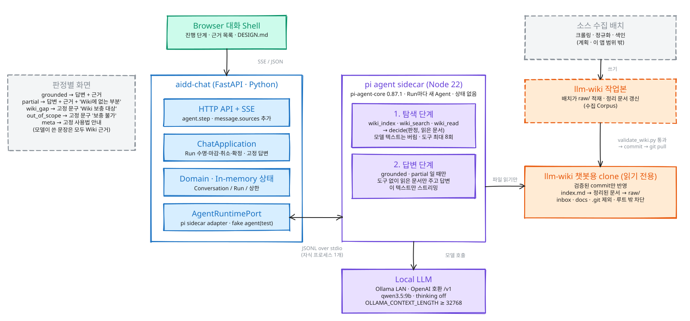

# Cite

모든 답에 근거 문서를. 익명 한국어 Q&A 대화 Shell(패키지명 `aidd-chat`). FastAPI + Wiki agent
(Node pi sidecar), In-memory 상태, SSE Streaming.

## 개요

시스템은 세 덩어리다. **Wiki agent**가 Wiki를 읽고 근거 있는 답만 만들고, **Cite**가 대화·Run·
상한을 관리하며, **소스 수집 배치**가 Wiki에 실릴 원본 문서를 채운다. 점선 Box는 아직 구현되지
않은 계획이다 -- 소스 수집 배치와 그 결과물(수집 Corpus)은 이 앱 범위 밖이다.



편집용 원본은 [`docs/architecture.excalidraw`](docs/architecture.excalidraw)이다
(excalidraw.com에서 열어 수정한 뒤 SVG로 다시 export한다).

| 덩어리 | 지금 상태 |
|--------|-----------|
| Wiki agent | pi sidecar(Node)가 Wiki를 읽기 전용 도구로 탐색한 뒤 Ollama(OpenAI 호환)로 답을 짓는다. `OLLAMA_BASE_URL`이 비면 Deterministic FakeAgent가 묶인다. |
| Cite | HTTP API + SSE, Domain 상태·용량 상한, `AgentRuntimePort` 뒤의 Adapters. 모든 상태가 In-memory라 Worker 1개·Replica 1개 전제다. |
| 소스 수집 배치 | 계획. Wiki 작업본을 채우고 검증된 commit만 읽기 전용 clone(`WIKI_ROOT`)으로 넘긴다. |

## Quick start

Model도 Network도 없이 Deterministic Provider로 띄우는 가장 짧은 경로다. Repository Root에서:

```sh
cp .env.example .env
```

`.env`에서 한 줄만 채운다(나머지 용량·Rate 값은 `.env.example`에 이미 들어 있다).

```
MAX_ATTEMPTS_PER_LINEAGE=3
```

`OLLAMA_BASE_URL`은 비워 둔다. `local_test` Profile에서 빈 Endpoint는 Deterministic Provider를
묶으라는 뜻이다.

```sh
uv sync --locked
uv run python -m uvicorn aidd_chat.main:app --port 8000
```

설정은 pydantic-settings가 Working Directory의 `.env`에서 자동으로 읽는다(Docker는 예외 --
`.env`를 Image에 굽지 않으므로 `--env-file`을 직접 넘긴다).

확인:

```sh
curl -i http://127.0.0.1:8000/ready         # 204
curl -i http://127.0.0.1:8000/api/v1/policy # 200
curl -i http://127.0.0.1:8000/              # 200, 대화 Shell
```

실제 Model을 붙이려면 Wiki agent(Node pi sidecar)가 필요하다. Provider·Wiki·Node 설정 전체와
Docker 실행법은 [`docs/wiki-agent-run.md`](docs/wiki-agent-run.md)에 있다.

## 로컬 LLM 연결

로컬 LLM(Ollama)은 Tailscale 네트워크 위의 Proxy로 접근한다. `.env`의 `OLLAMA_BASE_URL`에
그 Proxy의 Origin(`http(s)://host[:port]`)만 넣으면 되고, Model 이름은 태그까지 정확히 쓴다
(예: `qwen3.5:9b`). 나머지 설정은 [`docs/wiki-agent-run.md`](docs/wiki-agent-run.md)에 있다.

## `/ready`가 503일 때

원인은 둘뿐이고 기동 Log로 구분된다.

- **Log에 변수 이름이 남았다** -- 필수 변수가 빠졌거나 범위를 벗어났다. Process는 뜨지만
  `/ready`·`/api/v1/policy`가 503이고 새 대화 생성까지 거부된다(설계된 Fail-closed).
- **Log가 깨끗하다** -- 2초 Readiness Probe가 실패했다. Model Cold Start이거나 Endpoint에
  닿지 못한 경우다. `OLLAMA_BASE_URL`만 설정하고 `OLLAMA_API_KEY`를 비워 둔 경우도 여기서
  드러나며, Deterministic Stub으로 조용히 대체되지 않는다.

## 계약과 설정

- API 계약 전체: `GET /openapi.json` (모든 Operation, Schema, 한국어 Error Envelope)
- SSE의 Envelope·순서·`Last-Event-ID` Replay·Terminal Close·만료 Tail:
  [`docs/sse-contract.md`](docs/sse-contract.md)
- 환경변수 이름·유효값·기본값: [`.env.example`](.env.example)

핵심 불변식만 추리면: 대화는 생성 시각 +3,600초에 절대 만료하고 어떤 활동도 이를 연장하지
않는다. Run은 접수부터 120초 Wall-clock Deadline을 가진다. 용량·Rate 상한 17개는 기본값이
없어서, 채우지 않으면 기동은 되지만 `/ready`가 계속 503이다.

CLI에서 `http://`로 API를 직접 몰면 대화 생성 이후 모든 요청이 404다 -- Capability Cookie가
`Secure`라 `http://`로 되돌아가지 않기 때문이며, Browser는 `http://127.0.0.1`을 Secure
Context로 보므로 정상 동작한다.

## Docker

```sh
docker build --pull -t aidd-chat:local .
docker run --rm -p 127.0.0.1:7860:7860 --env-file .env aidd-chat:local
```

Bind를 `127.0.0.1`로 묶은 것은 의도적이다 -- `-p 7860:7860`은 인증 없는 데모를 모든 Interface에
공개한다. Image는 `pyproject.toml`·`uv.lock`·`.python-version`·`src/`와, pi sidecar 전용
Build Stage에서 pruned된 `agent/`(및 Node 자체)만 COPY하므로 Credential이 Layer에 들어갈 수
없고, `tests/test_story_1_11_docker.py`가 이를 고정한다. Release는 이 local Docker Image가
전부다 -- 별도 배포 대상(HF Space 등)은 없다. Wiki agent를 Docker에서 실제로 묶는 절차(Volume,
`.env` 일곱 Key)는 [`docs/wiki-agent-run.md`](docs/wiki-agent-run.md)에 있다.

## Test

```sh
uv run pytest -q
```

Browser Test는 Playwright Chromium이 필요하다(`uv run playwright install chromium`).
Test Suite는 항상 Deterministic Provider를 묶으므로 `.env` 없이도 통과한다.

Node pi sidecar Test는 별도다: `node --test "agent/*.test.mjs" tests/markdown.test.mjs`.
Push나 배포 전 Gate는 [`docs/wiki-agent-run.md`](docs/wiki-agent-run.md)의
`uv run python scripts/adoption_gate.py` 하나로 묶는다.
